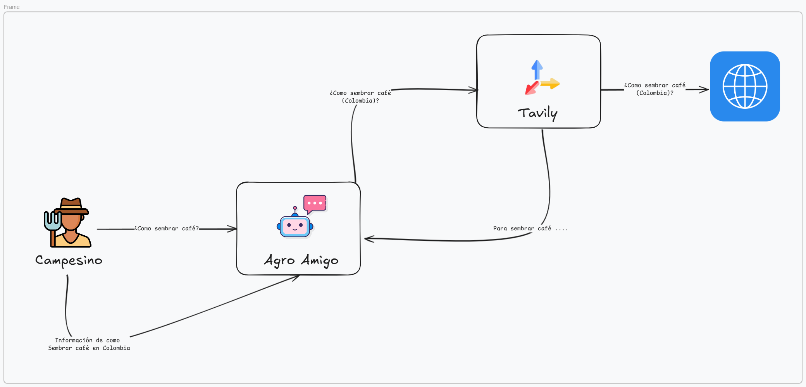

# **Chatbot Agrícola para Campesinos Colombianos**


Este proyecto es una aplicación de chatbot desarrollada para brindar soporte y asesoramiento a campesinos colombianos en temas relacionados con la agricultura, técnicas de cultivo y consejos financieros. La aplicación está construida en Python 3.12 y emplea varias tecnologías para ofrecer una experiencia de usuario fluida y una interacción basada en IA.

## **Tecnologías Utilizadas**

- **Groq API (Llama3-70B)**: El chatbot utiliza el modelo de lenguaje Llama3-70B a través de la API de Groq, permitiendo procesar y responder preguntas complejas con información relevante y contextual.
  
- **Tavily**: Este servicio se integra para realizar búsquedas de información en internet, asegurando que el chatbot pueda proporcionar respuestas actualizadas y precisas, especialmente en temas específicos como técnicas agrícolas y datos financieros pertinentes.

- **Streamlit**: Streamlit se utiliza para crear una interfaz de usuario amigable e interactiva, permitiendo a los usuarios formular preguntas y recibir respuestas de manera visual y organizada.


Aquí tienes la sección de instalación para tu proyecto "Chatbot Agrícola para Campesinos Colombianos":

## **Arquitectura**



## **Instalación**

Para configurar el chatbot, sigue estos pasos:

1. **Clonar el Repositorio**  
   Abre una terminal y clona el repositorio con el siguiente comando:
   ```bash
   git clone https://github.com/Jenniferlopezm/AgroAmigo.git
   cd AgroAmigo
   ```

2. **Crear un Entorno Virtual**  
   Crea un entorno virtual para gestionar las dependencias del proyecto:
   ```bash
   python -m venv venv
   ```

3. **Activar el Entorno Virtual**  
   - En Windows:
     ```bash
     venv\Scripts\activate
     ```
   - En macOS/Linux:
     ```bash
     source venv/bin/activate
     ```

4. **Instalar Requerimientos**  
   Instala las dependencias necesarias para el proyecto:
   ```bash
   pip install -r requirements.txt
   ```

5. **Crear un Archivo .env**  
   Crea un archivo llamado `.env` en la raíz del proyecto y añade tus claves API y otras configuraciones necesarias:
   ```plaintext
   GROQ_API_KEY=tu_clave_api_de_groq
   TAVILY_API_KEY=tu_clave_api_de_tavily
   ```

6. **Guías para Obtener las APIs**  
   - [Cómo obtener la API de Groq](https://console.groq.com/keys)  
   - [Cómo obtener la API de Tavily](https://docs.tavily.com/docs/gpt-researcher/getting-started)

Ahora tu chatbot estará listo para funcionar. Puedes iniciar la aplicación ejecutando:
```bash
streamlit run app.py
```

